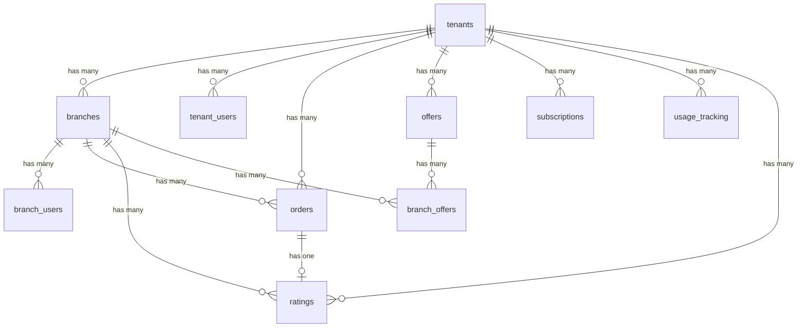
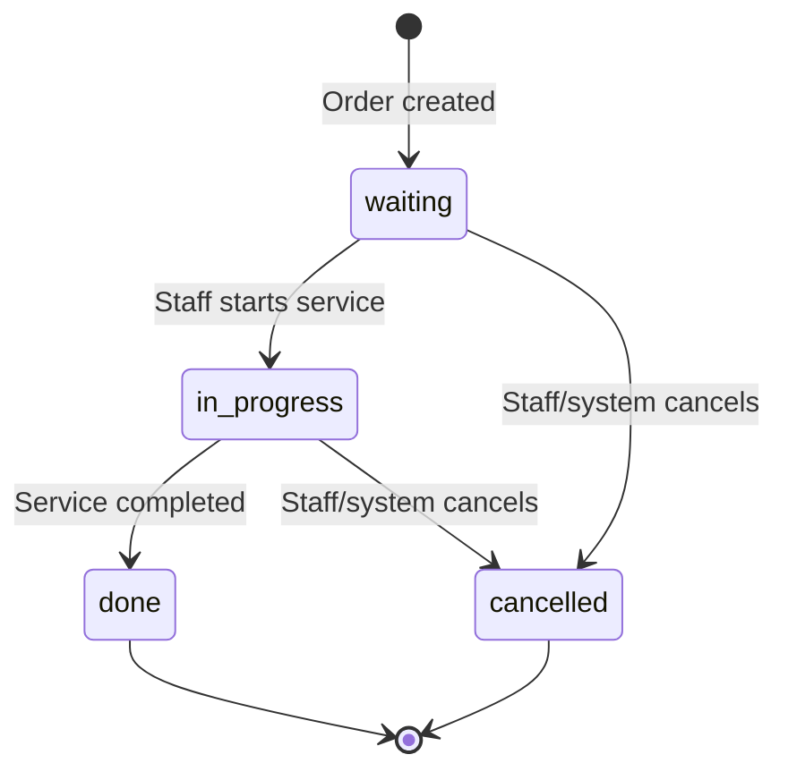

# Data Model: Database Foundation

**Branch**: `001-database-foundation` | **Date**: 2026-02-27

## Entity-Relationship Overview

---

## Entities

### 1. tenants

The top-level organizational unit. All data is ultimately scoped to a tenant.

| Column | Type | Constraints | Default | Notes |
|--------|------|-------------|---------|-------|
| id | uuid | PK | `gen_random_uuid()` | |
| name | text | NOT NULL | | Tenant display name |
| logo_url | text | | | Optional branding |
| description | text | | | Optional description |
| created_at | timestamptz | NOT NULL | `now()` | |
| updated_at | timestamptz | NOT NULL | `now()` | Auto-updated via trigger |

**Indexes**: PK on `id`  
**On delete**: CASCADE to all data tables

---

### 2. branches

A physical or logical location where queue operations occur.

| Column | Type | Constraints | Default | Notes |
|--------|------|-------------|---------|-------|
| id | uuid | PK | `gen_random_uuid()` | |
| tenant_id | uuid | FK → tenants.id, NOT NULL | | ON DELETE CASCADE |
| name | text | NOT NULL | | Branch display name |
| address | text | | | Optional |
| avg_service_duration | int | NOT NULL, CHECK (> 0) | | Minutes per service (FR-019) |
| created_at | timestamptz | NOT NULL | `now()` | |
| updated_at | timestamptz | NOT NULL | `now()` | Auto-updated via trigger |

**Indexes**: PK on `id`, index on `tenant_id`  
**On delete**: CASCADE to orders, ratings, branch_offers, branch_users (RESTRICT)

---

### 3. tenant_users

Maps users to tenants with tenant-level roles.

| Column | Type | Constraints | Default | Notes |
|--------|------|-------------|---------|-------|
| id | uuid | PK | `gen_random_uuid()` | |
| tenant_id | uuid | FK → tenants.id, NOT NULL | | ON DELETE RESTRICT |
| user_id | uuid | FK → auth.users.id, NOT NULL | | ON DELETE CASCADE |
| role | text | NOT NULL, CHECK IN ('tenant_admin') | | |

**Indexes**: PK on `id`, index on `tenant_id`, index on `user_id`  
**Unique constraint**: (`tenant_id`, `user_id`) — prevents duplicate mappings (FR-017)

---

### 4. branch_users

Maps users to branches with branch-level roles.

| Column | Type | Constraints | Default | Notes |
|--------|------|-------------|---------|-------|
| id | uuid | PK | `gen_random_uuid()` | |
| branch_id | uuid | FK → branches.id, NOT NULL | | ON DELETE RESTRICT |
| user_id | uuid | FK → auth.users.id, NOT NULL | | ON DELETE CASCADE |
| role | text | NOT NULL, CHECK IN ('branch_manager', 'branch_staff') | | |

**Indexes**: PK on `id`, index on `branch_id`, index on `user_id`  
**Unique constraint**: (`branch_id`, `user_id`) — prevents duplicate mappings (FR-017)

---

### 5. orders

A queue entry within a branch, tracking lifecycle from creation to completion.

| Column | Type | Constraints | Default | Notes |
|--------|------|-------------|---------|-------|
| id | uuid | PK | `gen_random_uuid()` | |
| tenant_id | uuid | FK → tenants.id, NOT NULL | | ON DELETE CASCADE |
| branch_id | uuid | FK → branches.id, NOT NULL | | ON DELETE CASCADE |
| order_number | text | NOT NULL | | Application-enforced daily uniqueness per branch |
| status | text | NOT NULL, CHECK IN ('waiting', 'in_progress', 'done', 'cancelled') | `'waiting'` | |
| source | text | NOT NULL, CHECK IN ('manual', 'api') | | |
| created_at | timestamptz | NOT NULL | `now()` | |
| started_at | timestamptz | | | Set when status → in_progress |
| completed_at | timestamptz | | | Set when status → done |

**Indexes**: PK on `id`, index on `tenant_id`, index on `branch_id`

---

### 6. offers

Promotional items that can be tenant-wide or branch-specific.

| Column | Type | Constraints | Default | Notes |
|--------|------|-------------|---------|-------|
| id | uuid | PK | `gen_random_uuid()` | |
| tenant_id | uuid | FK → tenants.id, NOT NULL | | ON DELETE CASCADE |
| title | text | NOT NULL | | |
| description | text | | | |
| image_url | text | | | |
| is_global | boolean | NOT NULL | `false` | If true, applies to all branches |
| is_active | boolean | NOT NULL | `true` | |
| created_at | timestamptz | NOT NULL | `now()` | |
| updated_at | timestamptz | NOT NULL | `now()` | Auto-updated via trigger |

**Indexes**: PK on `id`, index on `tenant_id`

---

### 7. branch_offers

Junction table linking offers to specific branches.

| Column | Type | Constraints | Default | Notes |
|--------|------|-------------|---------|-------|
| id | uuid | PK | `gen_random_uuid()` | |
| branch_id | uuid | FK → branches.id, NOT NULL | | ON DELETE CASCADE |
| offer_id | uuid | FK → offers.id, NOT NULL | | ON DELETE CASCADE |

**Indexes**: PK on `id`, index on `branch_id`, index on `offer_id`  
**Unique constraint**: (`branch_id`, `offer_id`) — prevents duplicate associations

---

### 8. subscriptions

Defines a tenant's subscription plan for a specific billing period. Multiple records per tenant track subscription history for SaaS analytics.

| Column | Type | Constraints | Default | Notes |
|--------|------|-------------|---------|-------|
| id | uuid | PK | `gen_random_uuid()` | |
| tenant_id | uuid | FK → tenants.id, NOT NULL | | ON DELETE CASCADE |
| plan_name | text | NOT NULL | | |
| monthly_order_limit | int | NOT NULL | | |
| current_period_start | date | NOT NULL | | |
| current_period_end | date | NOT NULL | | |
| is_active | boolean | NOT NULL | `true` | Only one active per tenant (app-enforced) |
| created_at | timestamptz | NOT NULL | `now()` | |

**Indexes**: PK on `id`, index on `tenant_id`  
**Note**: Only one subscription per tenant should have `is_active = true` at any time. This is enforced at the application level. When a new plan starts, the previous subscription is deactivated (`is_active = false`).

---

### 9. usage_tracking

Records monthly order counts per tenant for subscription enforcement.

| Column | Type | Constraints | Default | Notes |
|--------|------|-------------|---------|-------|
| id | uuid | PK | `gen_random_uuid()` | |
| tenant_id | uuid | FK → tenants.id, NOT NULL | | ON DELETE CASCADE |
| month | text | NOT NULL | | Format: YYYY-MM |
| orders_count | int | NOT NULL | `0` | Incremented atomically |

**Indexes**: PK on `id`, index on `tenant_id`  
**Unique constraint**: (`tenant_id`, `month`) — one record per tenant per month (FR-010)

---

### 10. ratings

Customer feedback for completed orders.

| Column | Type | Constraints | Default | Notes |
|--------|------|-------------|---------|-------|
| id | uuid | PK | `gen_random_uuid()` | |
| tenant_id | uuid | FK → tenants.id, NOT NULL | | ON DELETE CASCADE |
| branch_id | uuid | FK → branches.id, NOT NULL | | ON DELETE CASCADE |
| order_id | uuid | FK → orders.id, NOT NULL | | ON DELETE CASCADE |
| rating | int | NOT NULL, CHECK (1 <= rating <= 5) | | FR-012 |
| feedback | text | | | Optional |
| created_at | timestamptz | NOT NULL | `now()` | |

**Indexes**: PK on `id`, index on `tenant_id`, index on `branch_id`  
**Unique constraint**: `order_id` — one rating per order (FR-020)

---

## State Transitions

### Order Status

**Note**: State transitions are enforced at the application layer (not database triggers). The database only validates that the status value is one of the allowed values.

---

## Validation Rules Summary

| Rule | Table | Type | Requirement |
|------|-------|------|-------------|
| Status enum | orders | CHECK | `IN ('waiting', 'in_progress', 'done', 'cancelled')` |
| Source enum | orders | CHECK | `IN ('manual', 'api')` |
| Role enum | tenant_users | CHECK | `IN ('tenant_admin')` |
| Role enum | branch_users | CHECK | `IN ('branch_manager', 'branch_staff')` |
| Rating range | ratings | CHECK | `1 <= rating <= 5` |
| Duration positive | branches | CHECK | `avg_service_duration > 0` |
| One rating per order | ratings | UNIQUE | `order_id` |
| One user per tenant | tenant_users | UNIQUE | `(tenant_id, user_id)` |
| One user per branch | branch_users | UNIQUE | `(branch_id, user_id)` |
| One record per month | usage_tracking | UNIQUE | `(tenant_id, month)` |
| One offer per branch | branch_offers | UNIQUE | `(branch_id, offer_id)` |
