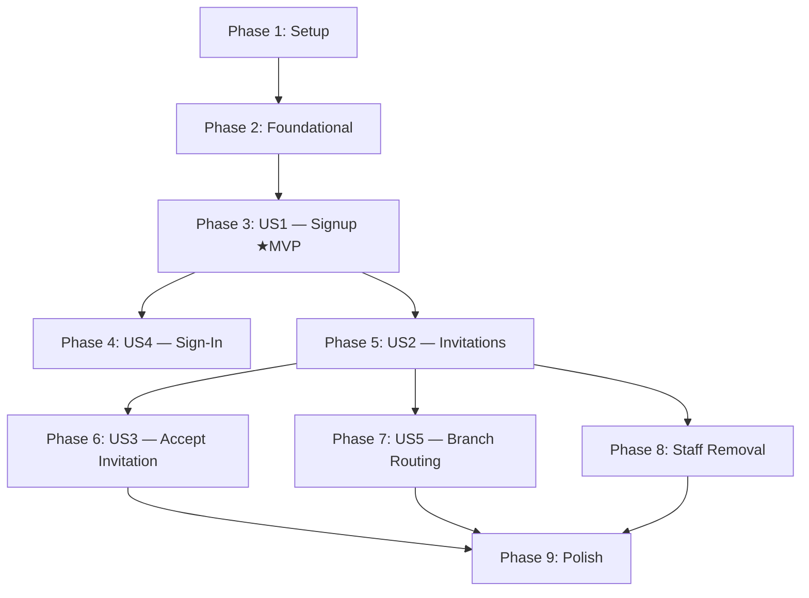

# Tasks: Authentication & Role Assignment

**Input**: Design documents from `/specs/003-auth-role-assignment/`  
**Prerequisites**: plan.md ✅, spec.md ✅, research.md ✅, data-model.md ✅, contracts/ ✅, quickstart.md ✅

**Organization**: Tasks are grouped by user story to enable independent implementation and testing of each story.

## Format: `[ID] [P?] [Story] Description`

- **[P]**: Can run in parallel (different files, no dependencies)
- **[Story]**: Which user story this task belongs to (e.g., US1, US2, US3)
- Include exact file paths in descriptions

---

## Phase 1: Setup (Shared Infrastructure)

**Purpose**: Project initialization, folder structure, and shared dependencies

- [x] T001 Create core folder structure: `lib/core/constants/`, `lib/core/utils/`, `lib/core/services/`, `lib/core/shared_widgets/`
- [x] T002 Create feature folder structure: `lib/features/auth/data/repositories/`, `lib/features/auth/data/models/`, `lib/features/auth/logic/`, `lib/features/auth/ui/pages/`, `lib/features/auth/ui/widgets/`, `lib/features/invitations/data/repositories/`, `lib/features/invitations/data/models/`, `lib/features/invitations/logic/`, `lib/features/invitations/ui/pages/`, `lib/features/invitations/ui/widgets/`
- [x] T003 Add required dependencies to `pubspec.yaml`: `supabase_flutter`, `flutter_bloc`, `equatable`
- [x] T004 [P] Create environment configuration in `lib/core/constants/app_config.dart` — define `baseUrl` (localhost for dev, `admin.ontapi.com` for production), Supabase URL, and anon key

---

## Phase 2: Foundational (Blocking Prerequisites)

**Purpose**: Database migration and core auth service that ALL user stories depend on

**⚠️ CRITICAL**: No user story work can begin until this phase is complete

- [x] T005 Create database migration `supabase/migrations/20260302175400_auth_role_assignment.sql` — Part 1: Create `public.invitations` table with all columns, indexes, CHECK constraints, and partial unique index (`uq_invitations_branch_email_pending`) per `data-model.md`
- [x] T006 Add to migration — Part 2: Add `UNIQUE(user_id)` constraint on `public.tenant_users` to enforce single-tenant-admin-per-user (FR-019)
- [x] T007 Add to migration — Part 3: Create `public.handle_new_user_signup()` SECURITY DEFINER function and `AFTER INSERT` trigger on `auth.users` — reads `business_name` from `raw_user_meta_data`, inserts tenant + branch + tenant_admin membership atomically per `data-model.md`
- [x] T008 Add to migration — Part 4: Create `public.accept_invitation(UUID)` SECURITY DEFINER function — validates token, checks expiry, checks email match, checks role conflict, inserts `branch_users` record, marks invitation accepted per `data-model.md`
- [x] T009 Add to migration — Part 5: Enable RLS on `public.invitations` and create policies for tenant_admin (SELECT, INSERT, UPDATE on own tenant) and branch_manager (SELECT, INSERT, UPDATE on own branch) per `data-model.md`
- [x] T010 Validate migration by running `supabase db reset` and verifying all objects are created without errors
- [x] T011 Implement `AuthService` in `lib/core/services/auth_service.dart` — wrap Supabase Auth methods: `signUp(email, password, businessName)`, `signInWithPassword(email, password)`, `signOut()`, `currentUser`, `onAuthStateChange` stream per `contracts/auth-contracts.md`
- [x] T012 [P] Create `AppUser` model in `lib/features/auth/data/models/app_user.dart` — fields: `id`, `email`, `role` (enum: tenant_admin, branch_manager, branch_staff), `tenantId`, `branchId` (nullable), `branchIds` (list for multi-branch users)

**Checkpoint**: Migration applied, auth service ready, core model defined — user story implementation can now begin

---

## Phase 3: User Story 1 — New User Signs Up and Becomes a Tenant Admin (Priority: P1) 🎯 MVP

**Goal**: A new user signs up with email, password, and business name → system atomically provisions tenant + branch + admin role → user lands on dashboard

**Independent Test**: Complete the signup form with valid credentials → verify user is authenticated, tenant exists with correct name, default branch ("Main Branch") exists, user has `tenant_admin` role in `tenant_users`

### Implementation for User Story 1

- [x] T013 [P] [US1] Create `AuthRepository` in `lib/features/auth/data/repositories/auth_repository.dart` — methods: `signUp(email, password, businessName)`, `signIn(email, password)`, `signOut()`, `resolveUserRole(userId)` (queries `tenant_users` then `branch_users` to determine role and context)
- [x] T014 [P] [US1] Create `AuthState` in `lib/features/auth/logic/auth_state.dart` — states: `AuthInitial`, `AuthLoading`, `AuthAuthenticated(AppUser)`, `AuthUnauthenticated`, `AuthError(message)`, `AuthBranchSelection(List<branches>)`
- [x] T015 [US1] Create `AuthCubit` in `lib/features/auth/logic/auth_cubit.dart` — methods: `signUp(email, password, businessName)`, `signIn(email, password)`, `signOut()`, `resolveRole()` — emits appropriate `AuthState`; handles error mapping for duplicate email, weak password, existing admin constraint per `contracts/auth-contracts.md`
- [x] T016 [US1] Create `SignUpPage` in `lib/features/auth/ui/pages/sign_up_page.dart` — form with email, password, business name fields; validation (email format, password ≥8 chars, business name required); calls `AuthCubit.signUp()`; shows inline errors for duplicate email / weak password / existing admin; auto-routes to dashboard on success
- [x] T017 [US1] Create placeholder `TenantDashboardPage` in `lib/features/auth/ui/pages/tenant_dashboard_page.dart` — displays tenant name and "Main Branch" as confirmation; placeholder for future dashboard features
- [x] T018 [US1] Configure app routing in `lib/app.dart` — `AuthCubit` provided at root; initial route checks auth state; unauthenticated → sign-in page; authenticated → role-based routing (tenant_admin → dashboard); wrap with `BlocProvider<AuthCubit>`
- [x] T019 [US1] Update `lib/main.dart` — initialize Supabase with config from `app_config.dart`, run `App` widget

**Checkpoint**: User Story 1 fully functional — new user can sign up, get auto-provisioned, and land on dashboard

---

## Phase 4: User Story 4 — Tenant Admin Signs In to Existing Account (Priority: P1)

**Goal**: A returning Tenant Admin signs in with email/password → system resolves their tenant_admin role → routes to tenant dashboard

**Independent Test**: Sign in with valid Tenant Admin credentials → verify dashboard loads with correct tenant name; attempt with wrong password → verify error shown

### Implementation for User Story 4

- [ ] T020 [US4] Create `SignInPage` in `lib/features/auth/ui/pages/sign_in_page.dart` — form with email and password fields; validation; calls `AuthCubit.signIn()`; shows error for invalid credentials; routes to dashboard on success; link to signup page for new users
- [ ] T021 [US4] Add sign-out functionality to `TenantDashboardPage` — sign-out button that calls `AuthCubit.signOut()` and routes back to sign-in page
- [ ] T022 [US4] Update app routing in `lib/app.dart` — add sign-in page as default for unauthenticated users; handle `AuthCubit.onAuthStateChange` to auto-redirect on session expiry

**Checkpoint**: User Stories 1 & 4 functional — both signup and returning sign-in work end-to-end

---

## Phase 5: User Story 2 — Tenant Admin Invites Staff and Assigns Branch Roles (Priority: P2)

**Goal**: Tenant Admin can invite users by email to a specific branch with a branch_manager or branch_staff role, and manage (view, resend, revoke) pending invitations

**Independent Test**: Admin invites a user to a branch with a role → invitation record created with correct token and expiry → admin can view, resend, and revoke the invitation

### Implementation for User Story 2

- [ ] T023 [P] [US2] Create `Invitation` model in `lib/features/invitations/data/models/invitation.dart` — fields: `id`, `tenantId`, `branchId`, `branchName`, `email`, `role`, `status` (enum: pending, accepted, revoked, expired), `token`, `createdAt`, `expiresAt`; `fromJson()` / `toJson()` methods
- [ ] T024 [P] [US2] Create `InvitationState` in `lib/features/invitations/logic/invitation_state.dart` — states: `InvitationInitial`, `InvitationLoading`, `InvitationLoaded(List<Invitation>)`, `InvitationCreated(Invitation)`, `InvitationError(message)`, `InvitationLinkReady(String url)`
- [ ] T025 [US2] Create `InvitationRepository` in `lib/features/invitations/data/repositories/invitation_repository.dart` — methods: `createInvitation(tenantId, branchId, email, role, invitedBy)`, `listPendingInvitations(tenantId)`, `revokeInvitation(invitationId)`, `resendInvitation(invitationId)` (revokes old + creates new) per `contracts/auth-contracts.md`
- [ ] T026 [US2] Create `InvitationCubit` in `lib/features/invitations/logic/invitation_cubit.dart` — methods: `loadInvitations(tenantId)`, `createInvitation(...)`, `revokeInvitation(id)`, `resendInvitation(id)`, `generateInvitationLink(token)` (uses `AppConfig.baseUrl`); handles duplicate invitation error
- [ ] T027 [US2] Create `InvitationListPage` in `lib/features/invitations/ui/pages/invitation_list_page.dart` — displays pending invitations with branch name, email, role, expiry countdown; action buttons: revoke, resend, copy link; empty state for no invitations
- [ ] T028 [US2] Create `CreateInvitationDialog` or page in `lib/features/invitations/ui/widgets/create_invitation_dialog.dart` — form with email, branch selector (dropdown of tenant's branches), role selector (branch_manager / branch_staff); validates inputs; calls `InvitationCubit.createInvitation()`; shows generated link on success
- [ ] T029 [US2] Add navigation from `TenantDashboardPage` to `InvitationListPage` — "Manage Staff" or "Invitations" menu item in dashboard

**Checkpoint**: User Story 2 functional — admin can create, view, revoke, and resend invitations

---

## Phase 6: User Story 3 — Invited User Accepts Invitation and Gains Access (Priority: P3)

**Goal**: An invited user opens the invitation link, signs up or signs in, and is automatically assigned to the correct branch with the designated role

**Independent Test**: Send invitation → open link → sign up as new user → verify `branch_users` record created with correct branch and role; test with expired/revoked link → verify error shown

### Implementation for User Story 3

- [ ] T030 [US3] Create `AcceptInvitationPage` in `lib/features/invitations/ui/pages/accept_invitation_page.dart` — reads `token` from URL query parameter; shows loading state while validating; if user not authenticated → shows signup/sign-in choice; if authenticated → calls `accept_invitation` RPC; handles all status responses (success, invalid, email_mismatch, role_conflict, already_member) with clear messages
- [ ] T031 [US3] Add invitation token handling to `AuthRepository` — method `acceptInvitation(token)` that calls `supabase.rpc('accept_invitation', params: {'invitation_token': token})` and maps response per `contracts/auth-contracts.md`
- [ ] T032 [US3] Update app routing in `lib/app.dart` — add `/invite` route that reads `token` query parameter and navigates to `AcceptInvitationPage`; handle deep linking for both web and mobile
- [ ] T033 [US3] Update `SignUpPage` to accept optional invitation token — when signup is triggered from an invitation link, pass token through to auto-accept after registration completes
- [ ] T034 [US3] Update `SignInPage` to accept optional invitation token — when sign-in is triggered from an invitation link, auto-accept the invitation after successful authentication

**Checkpoint**: Full invitation lifecycle works — invite → accept → access granted

---

## Phase 7: User Story 5 — Branch Staff or Manager Signs In and Is Routed to Their Branch (Priority: P2)

**Goal**: A Branch Manager or Branch Staff signs in and is automatically routed to their assigned branch view; users with multiple branches see a selection screen

**Independent Test**: Sign in as branch_staff assigned to Branch A → verify branch-scoped view loads; sign in as user with roles in multiple branches → verify branch selector appears

### Implementation for User Story 5

- [ ] T035 [US5] Create `BranchSelectorPage` in `lib/features/auth/ui/pages/branch_selector_page.dart` — lists all branches the user is assigned to (from `branch_users` query); each entry shows branch name and role; selecting a branch navigates to the branch-scoped view
- [ ] T036 [US5] Create placeholder `BranchDashboardPage` in `lib/features/auth/ui/pages/branch_dashboard_page.dart` — displays branch name and user's role as confirmation; placeholder for future branch operations
- [ ] T037 [US5] Update role resolution in `AuthRepository.resolveUserRole()` — return `AuthBranchSelection` state when user has multiple branch memberships; return single branch context when only one exists
- [ ] T038 [US5] Update app routing in `lib/app.dart` — branch_manager → branch dashboard (or selector if multi-branch); branch_staff → branch dashboard (or selector if multi-branch); handle no-role state with a clear message

**Checkpoint**: All sign-in routing works — admin→dashboard, single branch→branch view, multi-branch→selector

---

## Phase 8: Staff Removal (FR-020)

**Purpose**: Tenant Admin can remove existing staff members from branches

- [ ] T039 [US2] Add `removeStaffMember(branchUserId)` method to `InvitationRepository` in `lib/features/invitations/data/repositories/invitation_repository.dart` — calls `supabase.from('branch_users').delete().eq('id', branchUserId)` per `contracts/auth-contracts.md`
- [ ] T040 [US2] Create `StaffListPage` or section in `lib/features/invitations/ui/pages/staff_list_page.dart` — lists current branch members (from `branch_users` joined with `branches`); shows name/email, branch, role; "Remove" action per member; confirmation dialog before removal
- [ ] T041 [US2] Add `StaffCubit` or extend `InvitationCubit` to handle `loadStaff(tenantId)` and `removeStaff(branchUserId)` — emits updated list after removal
- [ ] T042 [US2] Add navigation from `TenantDashboardPage` to `StaffListPage` — "Current Staff" menu item or tab alongside invitations

**Checkpoint**: Admin can view and remove existing staff members

---

## Phase 9: Polish & Cross-Cutting Concerns

**Purpose**: Improvements that affect multiple user stories

- [ ] T043 [P] Add form validation helpers in `lib/core/utils/validators.dart` — reusable email validation, password strength check (≥8 chars), required field check
- [ ] T044 [P] Add error message mapping in `lib/core/utils/error_mapper.dart` — map Supabase `AuthException` and `PostgrestException` codes to user-friendly messages
- [ ] T045 [P] Add loading and error state widgets in `lib/core/shared_widgets/` — reusable `LoadingOverlay`, `ErrorBanner`, `EmptyState` widgets
- [ ] T046 Run `quickstart.md` validation — execute all setup, signup, invitation, and constraint test steps
- [ ] T047 Review all routes and ensure unauthenticated access redirects to sign-in page consistently
- [ ] T048 Verify invitation expiry behavior — create invitation, wait or manually adjust `expires_at`, confirm link returns invalid status

---

## Dependencies & Execution Order

### Phase Dependencies

- **Setup (Phase 1)**: No dependencies — can start immediately
- **Foundational (Phase 2)**: Depends on Setup completion — **BLOCKS all user stories**
- **US1 (Phase 3)**: Depends on Foundational — **MVP target**
- **US4 (Phase 4)**: Depends on Phase 3 (uses `SignInPage` routing, `AuthCubit`)
- **US2 (Phase 5)**: Depends on Phase 3 (needs authenticated admin context and dashboard)
- **US3 (Phase 6)**: Depends on Phase 5 (needs invitations to accept)
- **US5 (Phase 7)**: Depends on Phase 5 (needs branch memberships created via invitation flow)
- **Staff Removal (Phase 8)**: Depends on Phase 5 (needs staff members to exist)
- **Polish (Phase 9)**: Depends on all desired user stories being complete

### User Story Dependencies



### Within Each User Story

- Models [P] before services/repositories
- Repositories before cubits
- Cubits before UI pages
- Core pages before route integration

### Parallel Opportunities

- T013 + T014 (AuthRepository + AuthState) — different files
- T023 + T024 (Invitation model + InvitationState) — different files
- T043 + T044 + T045 (validators, error mapper, shared widgets) — independent files

---

## Parallel Example: User Story 1

```text
# Parallel — different files, no dependencies:
T013: Create AuthRepository in lib/features/auth/data/repositories/auth_repository.dart
T014: Create AuthState in lib/features/auth/logic/auth_state.dart

# Sequential — T015 depends on T013 + T014:
T015: Create AuthCubit in lib/features/auth/logic/auth_cubit.dart

# Sequential — T016 depends on T015:
T016: Create SignUpPage in lib/features/auth/ui/pages/sign_up_page.dart
```

---

## Implementation Strategy

### MVP First (User Story 1 Only)

1. Complete Phase 1: Setup
2. Complete Phase 2: Foundational (migration + auth service)
3. Complete Phase 3: User Story 1 (signup → dashboard)
4. **STOP and VALIDATE**: Test signup flow end-to-end with `supabase db reset`
5. Deploy/demo if ready — complete signup-to-dashboard flow

### Incremental Delivery

1. Setup + Foundational → Migration applied, auth service ready
2. US1 (Signup) → **MVP!** New users can sign up and get provisioned
3. US4 (Sign-in) → Returning admin can sign in
4. US2 (Invitations) → Admin can invite staff
5. US3 (Accept) → Invited users can join
6. US5 (Branch routing) → Staff routed to correct branch view
7. Staff Removal → Admin can remove staff
8. Polish → Validation, error UX, shared widgets

### Suggested MVP Scope

**Phase 1 + Phase 2 + Phase 3 (T001–T019)**: 19 tasks delivering a complete signup flow.

---

## Notes

- [P] tasks = different files, no dependencies
- [Story] label maps task to specific user story for traceability
- Each user story is independently completable and testable after its dependencies
- Commit after each task or logical group
- Stop at any checkpoint to validate the story independently
- Migration tasks (T005–T009) are written as parts of a single migration file — implement sequentially within the file
